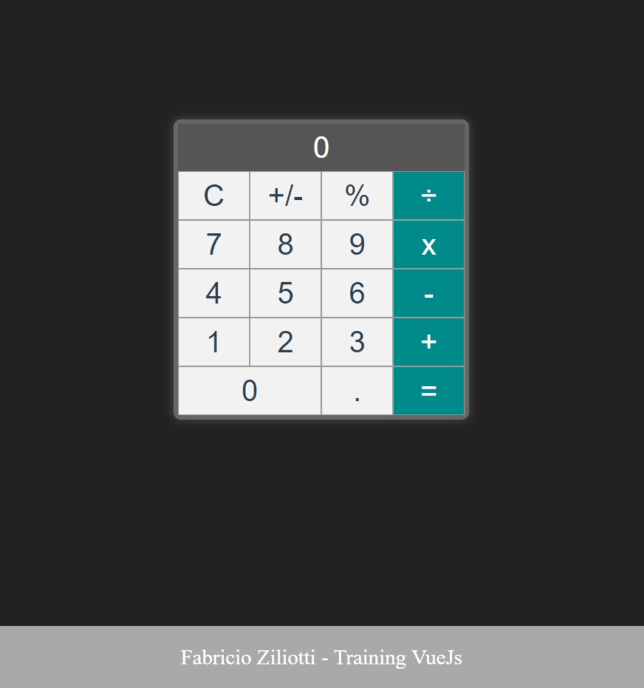

# Vue Calculator
Just a simple project to trainning Vue lib, the functions are based in a pullRequest in project of https://github.com/codyseibert/vue-calculator

## Instalation
### With npm:
```
npm install
```

### With yarn:
```
yarn install
```

## Running the app in development mode
```
npm run serve
```

## Run tests
```
npm t
```

##Image App


